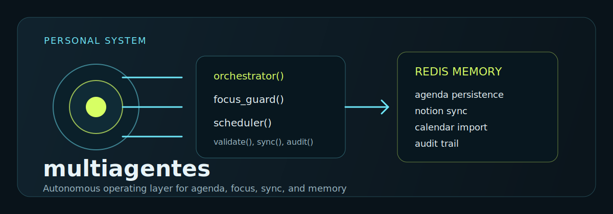

<!-- markdownlint-disable MD003 MD007 MD013 MD022 MD023 MD025 MD029 MD032 MD033 MD034 -->

```text
========================================
      MULTIAGENTES · PERSONAL CORE
========================================
```



Sistema multiagentes para gestão pessoal
com orquestração por IA, agenda local
persistida em Redis, sync com Notion,
integração com Google Calendar e
monitoramento autônomo de foco.

> **Status:** fase 2 operacional  
> **Python:** >=3.11  
> **Deploy:** Railway + Redis  
> **Interface:** FastAPI + Jinja2 + HTMX

────────────────────────────────────────

## What Is This?

A camada operacional de um sistema pessoal
que não trata produtividade como lista,
mas como fluxo entre intenção, agenda,
execução, validação e memória.

```text
┏━━━━━━━━━━━━━━━━━━━━━━━━━━━━━━━━━━━━━━┓
┃ MULTIAGENTES CAPABILITIES           ┃
┣━━━━━━━━━━━━━━━━━━━━━━━━━━━━━━━━━━━━━━┫
┃
┃ Orchestrator
┃   └─ roteia intenções do usuário
┃      e consolida respostas
┃
┃ Focus Guard
┃   └─ monitora atraso, desvio,
┃      sessão de foco e reage
┃      com auto-reagendamento
┃
┃ Scheduler
┃   └─ cria, ordena e move blocos
┃      de agenda
┃
┃ Notion Sync
┃   └─ sincroniza tarefas e agenda
┃      com databases do Notion
┃
┃ Calendar Sync
┃   └─ importa eventos do Google
┃      Calendar para blocos locais
┃
┃ Audit Trail
┃   └─ registra alertas, handoffs,
┃      desvios, logs e reações
┃
┗━━━━━━━━━━━━━━━━━━━━━━━━━━━━━━━━━━━━━━┛
```

────────────────────────────────────────

## Operational Flow

```text
Usuário
  │
  ├─ Web UI (/)
  └─ CLI (main.py)
       │
       ▼
  Orchestrator
       │
       ├─ Scheduler
       ├─ Focus Guard
       ├─ Notion Sync
       ├─ Calendar Sync
       ├─ Validator
       └─ Retrospective
             │
             ▼
          Redis
             │
             ├─ agenda
             ├─ tarefas
             ├─ alertas
             ├─ handoffs
             └─ auditoria
```

────────────────────────────────────────

## Quick Start

```bash
# 1. Criar ambiente e instalar dependências
make setup

# 2. Subir Redis local + app web
make dev-full

# 3. Acessar interface
open http://localhost:8000

# 4. Rodar testes
make test-q
```

> Se o Redis já estiver disponível, use `make dev`.

────────────────────────────────────────

## Core Surfaces

```text
┏━━━━━━━━━━━━━━━━━━━━━━━━━━━━━━━━━━━━━━┓
┃ SURFACE              PURPOSE        ┃
┣━━━━━━━━━━━━━━━━━━━━━━━━━━━━━━━━━━━━━━┫
┃ Web UI               dashboard,
┃                      agenda, audit,
┃                      chat
┃ CLI                  operação local
┃                      e automação
┃ Redis                persistência
┃                      operacional
┃ Notion               fonte externa
┃                      de tarefas
┃ Google Calendar      importação de
┃                      eventos
┃ Railway              deploy web +
┃                      healthcheck
┗━━━━━━━━━━━━━━━━━━━━━━━━━━━━━━━━━━━━━━┛
```

────────────────────────────────────────

## Repository Structure

```text
multiagentes/
├── agents/
│   ├── orchestrator.py      roteador central
│   ├── focus_guard.py       monitor de foco e atraso
│   ├── scheduler.py         agenda e blocos
│   ├── notion_sync.py       sync com Notion
│   ├── calendar_sync.py     sync com Google Calendar
│   ├── validator.py         validação de conclusão
│   └── retrospective.py     retrospectiva semanal
├── core/
│   ├── memory.py            persistência Redis
│   └── notifier.py          logs e saída operacional
├── web/
│   ├── app.py               FastAPI app
│   ├── templates/           páginas e partials
│   └── static/              manifest, service worker, ícones
├── docs/
│   ├── MANUAL_USUARIO.md
│   ├── MANUAL_DEV.md
│   └── roadmap.md
├── tests/
│   ├── test_memory.py
│   ├── test_focus_guard.py
│   ├── test_notion_sync.py
│   ├── test_orchestrator.py
│   └── test_web_chat.py
├── main.py                  entrypoint CLI
├── config.py                configuração central
├── Dockerfile               build Railway
├── Procfile                 entrypoint deploy
├── railway.json             healthcheck / restart policy
└── Makefile                 operação local
```

────────────────────────────────────────

## Main Pages

```text
▓▓▓ WEB INTERFACE
────────────────────────────────────────
└─ /                         dashboard principal
└─ /agenda                   agenda navegável por intervalo
└─ /audit                    alertas, eventos, handoffs e logs
└─ /health                   healthcheck para Railway

▓▓▓ INTERACTIONS
────────────────────────────────────────
└─ /chat                     conversa com orchestrator
└─ /task                     criação de tarefa
└─ /block/{id}/complete      conclusão de bloco
└─ /agenda/import            importação de intervalo
└─ /sync                     sincronização com Notion
```

────────────────────────────────────────

## Integrations

| Integração      | Papel                                | Variáveis principais                                                 |
| --------------- | ------------------------------------ | -------------------------------------------------------------------- |
| OpenAI          | roteamento e síntese do orchestrator | `OPENAI_API_KEY`, `OPENAI_MODEL`                                     |
| Notion          | sync de tarefas e agenda             | `NOTION_TOKEN`, `NOTION_TASKS_DB_ID`, `NOTION_AGENDA_DB_ID`          |
| Google Calendar | importação de eventos                | `GOOGLE_CREDENTIALS_FILE`, `GOOGLE_TOKEN_FILE`, `GOOGLE_CALENDAR_ID` |
| Redis           | memória e persistência               | `REDIS_URL`                                                          |
| Railway         | deploy do app web                    | `PORT`, `REDIS_URL`                                                  |

────────────────────────────────────────

## Environment Variables

```bash
OPENAI_API_KEY=
OPENAI_MODEL=gpt-4o

NOTION_TOKEN=
NOTION_TASKS_DB_ID=
NOTION_AGENDA_DB_ID=
NOTION_RETROSPECTIVE_PAGE_ID=

REDIS_URL=redis://localhost:6379/0

GOOGLE_CREDENTIALS_FILE=./credentials.json
GOOGLE_TOKEN_FILE=./token.json
GOOGLE_CALENDAR_ID=primary

FOCUS_CHECK_INTERVAL=15
NOTION_SYNC_INTERVAL=5

LOG_FILE=./logs/agent_system.log
LOG_LEVEL=INFO

WEB_HOST=127.0.0.1
WEB_PORT=8000
```

────────────────────────────────────────

## Make Commands

```text
┏━━━━━━━━━━━━━━━━━━━━━━━━━━━━━━━━━━━━━━┓
┃ COMMAND              ACTION         ┃
┣━━━━━━━━━━━━━━━━━━━━━━━━━━━━━━━━━━━━━━┫
┃ make setup           setup inicial
┃ make dev             FastAPI local
┃ make dev-full        FastAPI + Redis
┃ make guard           Focus Guard CLI
┃ make sync            sync Notion
┃ make agenda          agenda do dia
┃ make tasks           lista tarefas
┃ make calendar-auth   OAuth Calendar
┃ make calendar-import importa eventos
┃ make retro           retrospectiva
┃ make test-q          testes rápidos
┃ make check           lint + testes
┗━━━━━━━━━━━━━━━━━━━━━━━━━━━━━━━━━━━━━━┛
```

────────────────────────────────────────

## Persistence Model

- Estado operacional principal vive em Redis via [core/memory.py](./core/memory.py)
- Alertas, handoffs, agenda, sessões e auditoria são persistidos por chave
- Logs locais são gravados em arquivo configurado por `LOG_FILE`
- A interface `/audit` expõe a trilha de eventos e a cauda do log
- A agenda pode ser consultada e importada por intervalo em `/agenda`

────────────────────────────────────────

## Documentation

```text
▓▓▓ CORE DOCS
────────────────────────────────────────
└─ docs/MANUAL_USUARIO.md      uso do sistema
└─ docs/MANUAL_DEV.md          stack, rotas, PWA
└─ docs/roadmap.md             roadmap e próximas frentes

▓▓▓ OPERATIONS
────────────────────────────────────────
└─ Makefile                    comandos locais
└─ railway.json                política de deploy
└─ Dockerfile                  build de produção
```

────────────────────────────────────────

## Deploy

O deploy de produção está preparado para Railway:

```text
┏━━━━━━━━━━━━━━━━━━━━━━━━━━━━━━━━━━━━━━┓
┃ DEPLOY STACK                        ┃
┣━━━━━━━━━━━━━━━━━━━━━━━━━━━━━━━━━━━━━━┫
┃ Builder        Dockerfile           ┃
┃ Entrypoint      uvicorn web.app:app ┃
┃ Healthcheck     /health             ┃
┃ Persistence     Redis service       ┃
┗━━━━━━━━━━━━━━━━━━━━━━━━━━━━━━━━━━━━━━┛
```

Fluxo mínimo:

1. configurar variáveis de ambiente
2. anexar serviço Redis ao app
3. garantir que `REDIS_URL` aponte para o Redis do projeto
4. fazer deploy do branch `main`

────────────────────────────────────────

## Tests

```bash
# suíte completa
make test

# modo silencioso
make test-q

# cobertura
make test-cov
```

────────────────────────────────────────

## Authorship

- **Architecture & Lead:** NEØ MELLØ
- **Project Type:** sistema pessoal multiagentes para operação, foco e agenda
- **Direction:** transformar tarefas em sistema observável, reagente e persistente

────────────────────────────────────────

```text
▓▓▓ MULTIAGENTES
────────────────────────────────────────
Orchestration, memory and execution
for a personal operating system.
────────────────────────────────────────
```
